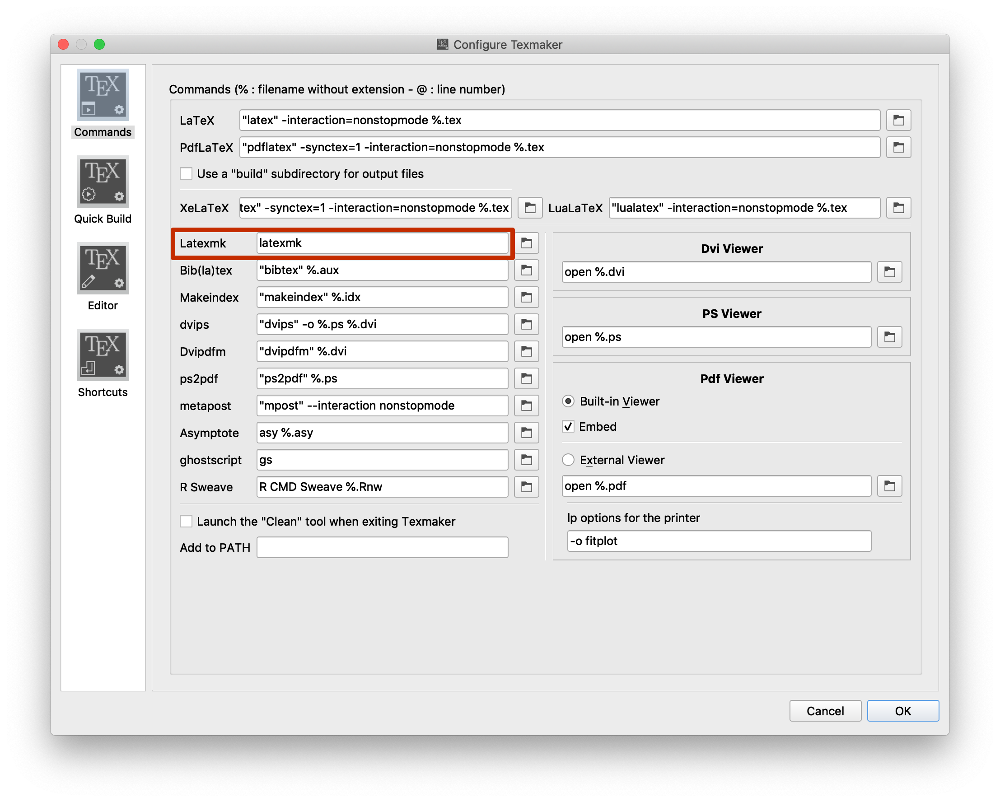
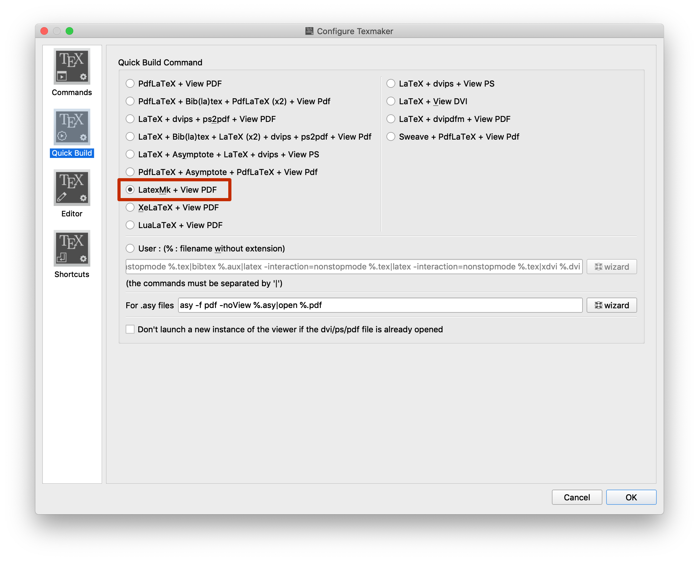
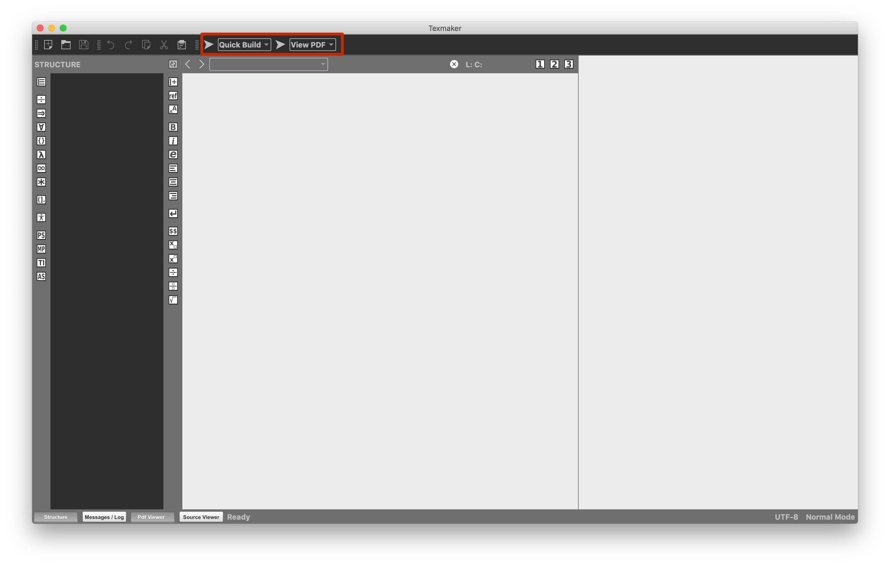

Monografia entitulada "Implementação de controlador MPC em um sistema a
parâmetros distribuídos via subsistemas interconectados", de autoria do
graduando Álan Crístoffer e Sousa.

Texto completo disponível [em PDF aqui](document.pdf).

# Instalação

Esse é um documento LaTeX. Você irá precisar instalar alguns softwares para
utilizá-lo. Primeiramente, você precisa de um ambiente LaTeX. Precisará também
de um editor (ok, não é necessário, mas é bom ter um). Para esse documento em
específico, porque uso o pacote _minted_ para colorir código fonte, você também
precisará instalar o Python e o pacote _pygments_.

## LaTeX

Para instalar o LaTeX no Windows baixe o [MiKTeX](https://miktex.org/download).

Para instalar no Linux, execute em um terminal:

- Ubuntu/Debian: `sudo apt install texlive-full`
- Fedora: `sudo dnf install texlive-scheme-full`
- OpenSUSE: `sudo zypper install texlive-scheme-full`

Para instalar no macOS:

- Usando [Homebrew](https://brew.sh): `brew cask install mactex`
- Manualmente: Baixe o
  [instalador](https://www.tug.org/mactex/mactex-download.html).

## Editor

Para todas as plataformas, baixe o [texmaker](http://www.xm1math.net/texmaker).
Obviamente é mais fácil instalar utilizando o terminal:

- macOS: `brew cask install texmaker`
- Ubuntu/Debian: `sudo apt install texmaker`
- Fedora: `sudo dnf install texmaker`
- OpenSUSE: `sudo zypper install texmaker`

## Python

- Windows: Baixe e instale o bundle [Anaconda](https://www.anaconda.com/).
  Embora o instalador diga que não é recomendado adicioná-lo ao PATH, adicione.
- Ubuntu/Debian: `sudo apt install python3 python3-pip`
- Fedora: `sudo dnf install python3 python3-pip`
- OpenSUSE: `sudo zypper install python3 python3-pip`
- macOS: `brew install python3`

## Pygments

Em qualquer plataforma, após o Python ter sido instalado, execute `pip install
pygments --user` ou `pip3 install pygments --user` (mais provável).

## Configuração do texmaker

3 configurações devem ser mudadas no aplicativo:

Após isso basta abrir o documento principal, _document.tex_.
